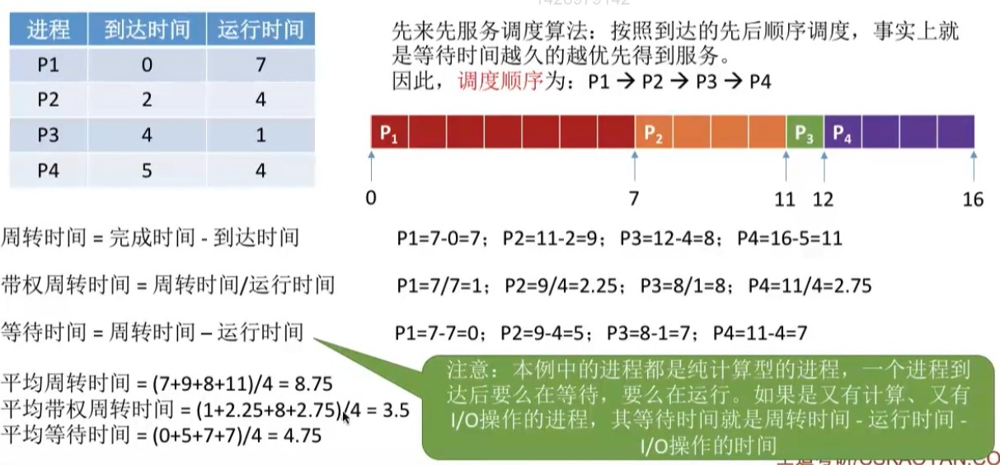

# 处理及管理系列实验三
> 本实验基于实验1代码编写, 详情移步到ex1分支查看
## 进程调度实现
### 准备步骤
- 更改PCB, 增加如下数据段
    - int arrival_time; //到达时间
    - int burst_time; //运行时间
    - int finished_time; //结束运行时间
    - int runned_time; //已运行时间
### 算法
- FCFS

~~~
//测试用例
100 2000
1 100 0 7
1 100 2 4
1 100 4 1
1 100 5 4
5 1
~~~
- SJF

~~~
//测试用例
100 2000
1 100 0 7
1 100 2 4
1 100 4 1
1 100 5 4
5 2
~~~
- RR

## 银行家算法
~~~
100 2000
1 100 0 5
1 100 2 4
1 100 4 1
1 100 5 6
5 3
~~~
//TODO

